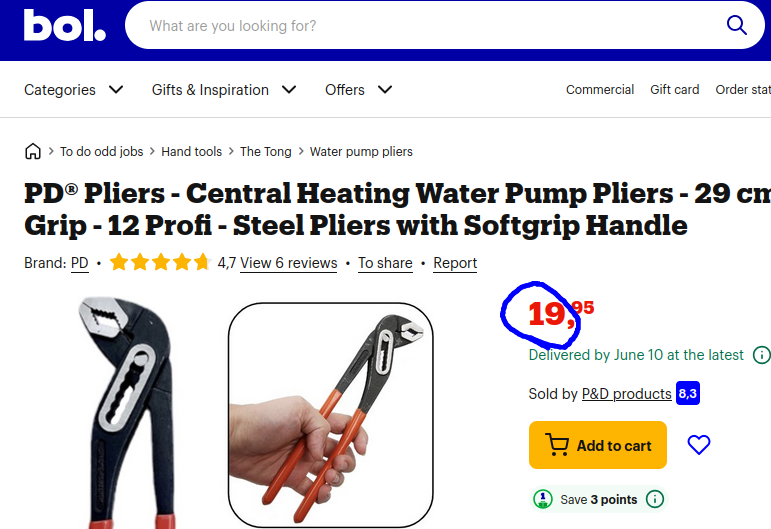
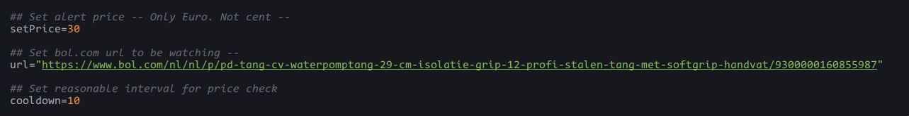
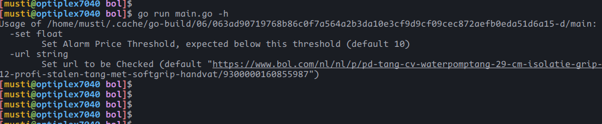
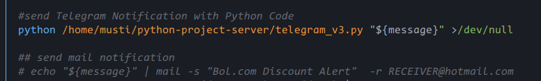
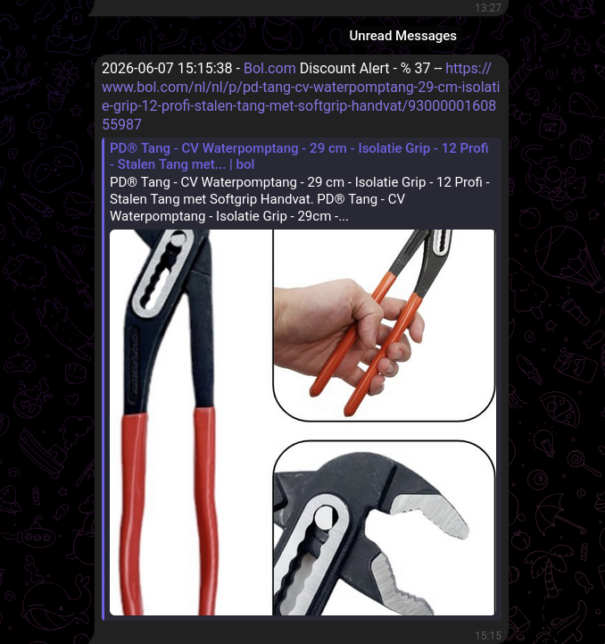

# Get Price Discount Notification for Specific Product on bol.com
> get bol.com link from product page .

 

### initial setting on shell code (./bol.sh)
> adjust settings on ./bol.sh
```bash
set "url" link for product on bol.com 
set "setPrice" for threshold price to be notified below  
set "cooldown"  check interval (seconds)
```
 


### main GO code to get price on bol.com

> help context 
```bash
go run main.go -h
```
 

> run raw code  -- only gives output json of the product such as status,price,url ..
```bash
go run main.go

```
```bash
{"url":"https://www.bol.com/nl/nl/p/pd-tang-cv-waterpomptang-29-cm-isolatie-grip-12-profi-stalen-tang-met-softgrip-handvat/9300000160855987","price":19,"status":200,"discount":0}
```

### Notification -- (./bol.sh)
> I have used my own Telegram bot. You can use your own notification system as mail,notify so on ..




> Preview - Telegram

 

### output log (./bol.log)

```bash 
[2026-06-07 15:24:19] -- Price dropped - % 37 --> https://www.bol.com/nl/nl/p/pd-tang-cv-waterpomptang-29-cm-isolatie-grip-12-profi-stalen-tang-met-softgrip-handvat/9300000160855987 -- 
[2026-06-07 15:24:20] -- No Discount -- {"url":"https://www.bol.com/nl/nl/p/pd-tang-cv-waterpomptang-29-cm-isolatie-grip-12-profi-stalen-tang-met-softgrip-handvat/9300000160855987","price":19,"status":200,"discount":0}
[2026-06-07 15:24:30] -- No Discount -- {"url":"https://www.bol.com/nl/nl/p/pd-tang-cv-waterpomptang-29-cm-isolatie-grip-12-profi-stalen-tang-met-softgrip-handvat/9300000160855987","price":19,"status":200,"discount":0}
[2026-06-07 15:24:41] -- No Discount -- {"url":"https://www.bol.com/nl/nl/p/pd-tang-cv-waterpomptang-29-cm-isolatie-grip-12-profi-stalen-tang-met-softgrip-handvat/9300000160855987","price":19,"status":200,"discount":0}
```
 
